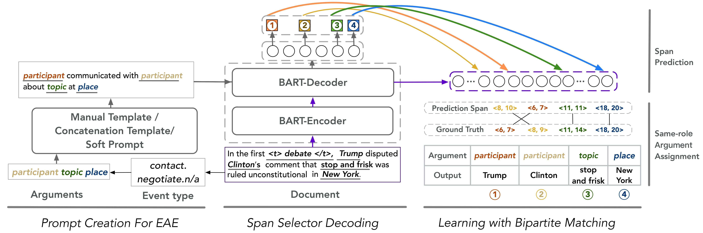

# PAIE (**P**rompting **A**rgument **I**nteraction for Event Argument **E**xtraction)
This is the implementation of the paper [Prompt for Extraction? PAIE: Prompting Argument Interaction for
Event Argument Extraction](https://arxiv.org/abs/2202.12109). ACL'2022.


## Quick links

* [Overview](#overview)
* [Preparation](#preparation)
  * [Environment](#environment)
  * [Data](#data)
* [Run the model](#run-lm-bff)
  * [Quick start](#quick-start)
  * [Experiments with multiple runs](#experiments-with-multiple-runs)
  * [Without bipartite loss](#without-bipartite-loss)
  * [Joint/Single prompts](#without-bipartite-loss)
  * [Manual/Concat/Soft prompts](#different-prompts)
  * [Few-shot experiments](#few-shot-experiments)
* [Citation](#citation)

## Overview


In this work we present PAIE: a simple, effective and low resource-required approach for sentence-/document-level event argument extraction. We formulate our contribution as follow.

1. We formulate and investigate prompt tuning under extractive settings. 
2. We extract multiple roles using a joint prompt once a time. It not only considers the interaction among different roles but also reduce time complexity significantly.


## Preparation

### Environment
to be finished

### Data
We conduct experiments on three common datasets: ACE05, RAMS and WIKIEVENTS.
- ACE05: This dataset is not freely available. Access from [LDC](https://catalog.ldc.upenn.edu/LDC2006T06) and preprocessing following [EEQA (2020'EMNLP)](https://github.com/xinyadu/eeqa/tree/master/proc).
- RAMS / WIKIEVENTS: We write a script for you for data processing. Run the following commands:

```bash
bash ./download_dataset.sh
```  

Please make sure your data folder structure as below.
```bash
data
  ├── ace_eeqa
  │   ├── train_convert.json
  │   ├── dev_convert.json
  │   └── test_convert.json
  ├── RAMS_1.0
  │   └── data
  │       ├── train.jsonlines
  │       ├── dev.jsonlines
  │       └── test.jsonlines
  ├── WikiEvent
  │   └── data
  │       ├── train.jsonl
  │       ├── dev.jsonl
  │       └── test.jsonl
  ├── prompts
  │   ├── prompts_ace_full.csv
  │   ├── prompts_wikievent_full.csv
  │   └── prompts_rams_full.csv
  └── dset_meta
      ├── description_ace.csv
      ├── description_rams.csv
      └── description_wikievent.csv
```

## Run the model

### Quick start
You could simply run PAIE with following commands: 
```bash
bash ./scripts/train_ace.sh
bash ./scripts/train_rams.sh
bash ./scripts/train_wikievent.sh
```
Folders will be created automatically to store: 

1. Subfolder `checkpoint`: model parameters with best dev set result
2. File `log.txt`: recording hyper-parameters, training process and evaluation result
3. File `best_dev_results.log`/`best_test_related_results.log`: showing prediction results of checkpoints on every sample in dev/test set.

You could see hyperparameter setting in `./scripts/train_[dataset].sh` and `config_parser.py`. We give most of hyperparameters a brief explanation in `config_parser.py`.

## Citation
Please cite our paper if you use PAIE in your work:
```bibtex
@article{ma2022prompt,
  title={Prompt for Extraction? PAIE: Prompting Argument Interaction for Event Argument Extraction},
  author={Ma, Yubo and Wang, Zehao and Cao, Yixin and Li, Mukai and Chen, Meiqi and Wang, Kun and Shao, Jing},
  journal={arXiv preprint arXiv:2202.12109},
  year={2022}
}
```

## Train and evaluate the model
After setting the data and pretrained checkpoints, simply run script with 
```bash
sh scripts/train_ace.sh
sh scripts/train_rams.sh
sh scripts/train_wikievent.sh
```